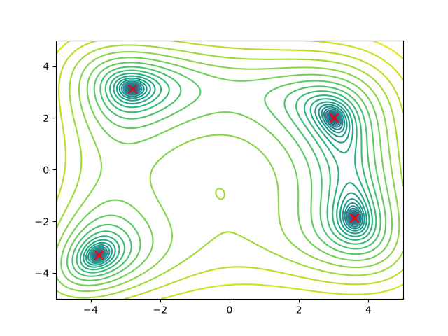

# FFR105 Home Problems 2

Python implementations of the two mandatory problems in FFR105 Home Problems 2 (2026): an ant system for the traveling salesman problem and particle swarm optimization for a function with several minima.

## Setup

The programs use Python 3, NumPy, and Matplotlib. Run these commands from the project folder in an environment that can display Matplotlib windows.

```bash
python -m pip install numpy matplotlib
```

## Problem 2.1: Traveling salesman problem

```bash
python run_ant_system.py
```

The ant system searches for a short closed tour through the 50 cities in `city_data.py`. Each ant starts at a random city and visits every other city once. Its next city is sampled using weights based on pheromone levels and inverse distance. After all ants complete their tours, pheromone evaporates and each ant deposits pheromone along the directed edges it travelled.

Whenever a shorter route is found, the program prints its length, redraws the route, and overwrites `best_result_found.py` with the new city-index list. The saved list has 50 entries; the return to the starting city is implicit. The search stops after an iteration brings the best length below `99.9999999`. Press Enter in the terminal at the final prompt to exit.

| Parameter | Value |
|---|---:|
| Ants per iteration | 50 |
| Pheromone exponent, alpha | 1.0 |
| Visibility exponent, beta | 5.0 |
| Evaporation rate, rho | 0.5 |
| Initial pheromone | 0.1 |

The saved route has length **99.7916064348**, including the closing edge. It visits all 50 cities exactly once and meets the assignment's under-100 target. This is the best retained result; global optimality has not been established.

## Problem 2.2: Particle swarm optimization

```bash
python run_pso.py
```

The objective function is

$$
f(x_1,x_2)=(x_1^2+x_2-11)^2+(x_1+x_2^2-7)^2.
$$

The program first displays a contour plot of `log(0.01 + f)` over `[-5, 5]` on both axes. Red crosses mark the four minima recorded from previous PSO runs. **Close the plot window to continue to the 20 fresh searches.** Each search prints its best position and function value in the terminal.

Each particle stores its personal best and is also guided by the swarm's best position. The velocity update combines inertia with random pulls toward these two points. Personal and swarm bests are updated after the particles move. Every run starts with new random positions and resets the inertia weight.

| Parameter | Value |
|---|---:|
| Particles per run | 30 |
| Iterations per run | 200 |
| Independent runs | 20 |
| Initial position range | `[-5, 5]` per coordinate |
| Initial velocities | Zero |
| Time step | 1.0 |
| Personal and swarm coefficients | 2.0 each |
| Initial inertia weight | 1.4 |
| Inertia multiplier per iteration | 0.99 |
| Minimum inertia weight | 0.4 |

The recorded 20-run experiment found these four distinct minima, with function values numerically close to zero:

| Approximate x1 | Approximate x2 |
|---:|---:|
| -2.80511809 | 3.13131252 |
| 3.00000000 | 2.00000000 |
| -3.77931025 | -3.28318599 |
| 3.58442834 | -1.84812653 |



## Main files

| File | Contents |
|---|---|
| `run_ant_system.py` | Ant-system implementation and live tour plot |
| `city_data.py` | Coordinates of the 50 cities supplied with the assignment |
| `best_result_found.py` | Saved tour as a list of city indices |
| `run_pso.py` | Objective function, contour plot, and repeated PSO searches |
| `Figure_1.png` | Contour plot with the four recorded minima marked |

Both algorithms use random sampling, so rerunning them can produce different routes, minima, and convergence times. The city data and ant-system starter template come from the course materials.
